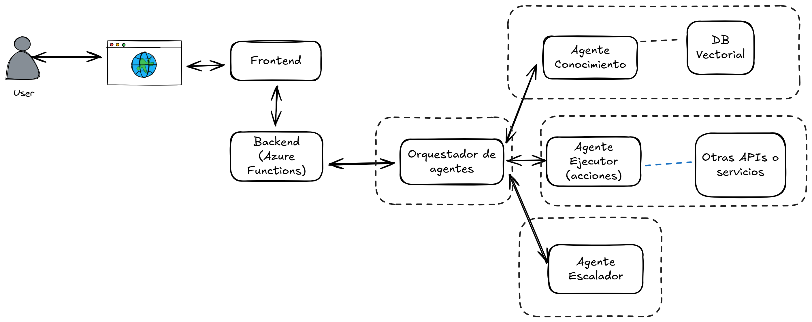

# 📘 Multiagents for Service Desk

This project contains an **Azure Function** that exposes an HTTP `/chat` endpoint powered by **Azure OpenAI** (GPT-4.1, GPT-4o, etc.).  
It is designed for **bots**, **Microsoft Teams integrations**, and **web applications** that require conversational AI.

---

## 📖 Table of Contents
1. [Project Description](#project-description)  
2. [Technologies Used](#technologies-used)  
3. [Project Structure](#project-structure)  
4. [Environment Variables Windows](#environment-variables-windows)  
5. [Local Setup](#local-setup)  
6. [Testing the /chat Endpoint](#testing-the-chat-endpoint)  
7. [Deployment Azure](#deployment-azure)  
8. [Required Environment Variables](#required-environment-variables)  
9. [Common Issues & Fixes](#common-issues--fixes)  
10. [Captures & Screenshots](#captures--screenshots)  
11. [Contributing](#contributing)  
12. [License](#license)

---

##  Project Description 
This project implements a Python-based Azure Functions Backend that exposes the /chat endpoint, making it ideal for chat integrations in web applications or Microsoft Teams. This backend serves as the gateway for an advanced Artificial Intelligence–powered system that uses Azure OpenAI GPT and a Multi-Agent Architecture to generate responses. The User’s request is processed by an Agent Orchestrator, which dynamically routes the task to the most suitable agent: the Knowledge Agent to retrieve contextual information from a Vector Database, the Execution Agent to perform actions by interacting with external APIs or services, or the Escalation Agent to assist in planning complex tasks. This modular design ensures that requests are broken down, efficiently handled by AI specialists, and the coherent response is sent back to the user through the same channel.




---

## Technologies Used
- Azure Functions (Python)  
- Azure OpenAI Service  
- Python 3.10+  
- OpenAI Python SDK  
- Azure Functions Core Tools  
- Windows Terminal / Git Bash / PowerShell  

---

## Project Structure

```text
backend-functions/
│── function_app.py           # Main Azure Functions entry point
│── requirements.txt          # Python dependencies
│── host.json                 # Global host configuration
│── local.settings.json       # Local development settings (not committed)
│── package.json              # JS/TypeScript tooling (optional)
│── __pycache__/              # Python cache (ignored)
```


##  Environment Variables (Windows)


Create local.settings.json in backend-functions/:

        {
        "IsEncrypted": false,
        "Values": {
            "AzureWebJobsStorage": "UseDevelopmentStorage=true",
            "FUNCTIONS_WORKER_RUNTIME": "python",
            "AZURE_OPENAI_ENDPOINT": "https://<your-resource>.openai.azure.com",
            "AZURE_OPENAI_API_KEY": "<your-api-key>",
            "AZURE_OPENAI_DEPLOYMENT": "gpt-4.1"
        }
        }


# Local Setup

## 1️⃣ Install dependencies

    pip install -r requirements.txt


## 2️⃣ Start the local server

    func start


3️⃣ Test the /chat endpoint

    curl -X POST http://localhost:7071/api/chat \
    -H "Content-Type: application/json" \
    -d '{"message": "Hello"}'

## Testing the /chat Endpoint

    POST /chat

This function connects to Azure OpenAI GPT using your deployment name and returns an AI-generated response.

    Request

    {
    "message": "Hello"
    }


Response

    {
    "response": "Hello! How can I help you today?"
    }

## Deployment (Azure)

Deploy using Azure Functions Core Tools:

    func azure functionapp publish <your-function-app-name>


Or using GitHub Actions / Azure DevOps Pipelines.

##  Required Environment Variables

    Variable	Description
    AZURE_OPENAI_ENDPOINT	Your Azure OpenAI endpoint
    AZURE_OPENAI_API_KEY	Key from Azure OpenAI
    AZURE_OPENAI_DEPLOYMENT	Name of the GPT model deployment
    AzureWebJobsStorage	Required for Azure Functions
    FUNCTIONS_WORKER_RUNTIME	Must be python


🧩 Common Issues & Fixes

❌ 404: Resource Not Found

Check:

- Correct Azure OpenAI endpoint

- Correct deployment name

- Correct model version

- Proper resource region

- API version in your request


🤝 Contributing

1️⃣ Create a new branch:

git checkout -b feature/my-feature


2️⃣ Commit changes:

    git add .
    git commit -m "Add new feature"


3️⃣ Push and create a Pull Request.


## 🎥 Demo Video – Team 7


https://raw.githubusercontent.com/innovation-challenge-equipo-7/multiagents-service-desk/main/demo/demoTeam7-demo.mp4

(GitHub no reproduce videos MP4 en línea, pero puedes abrir el enlace directamente para verlo.)

📺 Vista previa


## 👥 Team 7 — Collaborators

- **Evelyn Quevedo Garrido**  
  🔗  https://github.com/evymari
- **María Cristina Montoya**   
  🔗 https://github.com/mcml1225

- **Stalin Maza**  
  
  🔗 GitHub: 
https://github.com/StalinMazaEpn
- **Reewos Talla Chumpitaz**  
  
  🔗 https://github.com/reewos

"Thank you for visiting our project! 🎉"